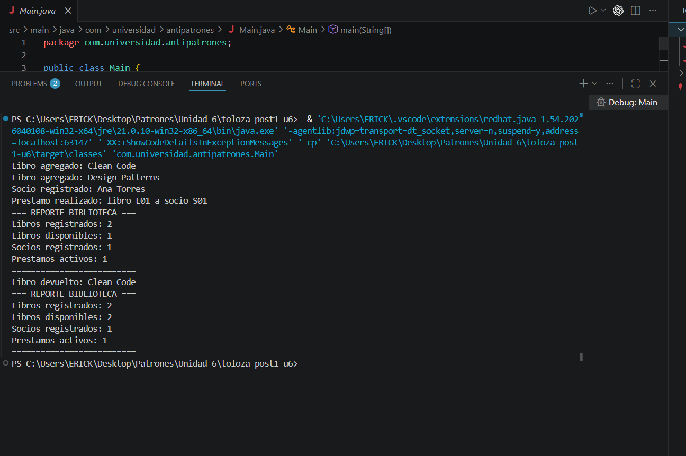
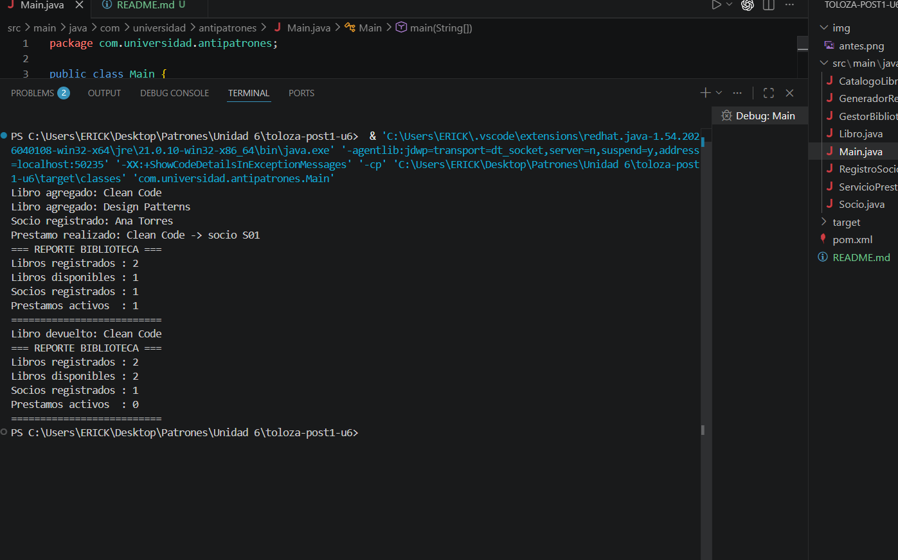

#  Refactoring Lab – Sistema de Facturación
## Descripción

Este proyecto consiste en la refactorización de un sistema de generación de facturas que inicialmente presentaba un antipatrón de diseño conocido como **God Object**.

El objetivo fue mejorar la estructura del código aplicando el principio **SRP (Single Responsibility Principle)**, logrando una mejor organización, mantenibilidad y escalabilidad del sistema.

## Antipatrón identificado: God Object

El sistema original estaba implementado en una única clase llamada `GeneradorFactura`, la cual concentraba demasiadas responsabilidades en un solo lugar.

Esto provocaba:
* Código difícil de mantener
* Alta dependencia entre funcionalidades
* Baja claridad en la estructura lógica

## Responsabilidades encontradas

Dentro de la clase `GeneradorFactura` se identificaron las siguientes 4 responsabilidades principales:

1.  **Modelado de datos:** Definición de los atributos de la factura.
2.  **Cálculo de impuestos:** Lógica para calcular IVA y montos totales.
3.  **Gestión de persistencia:** Simulación del guardado de datos en un repositorio.
4.  **Servicio de notificación:** Lógica para el envío de correos electrónicos.

## Patrón aplicado: SRP (Single Responsibility Principle)

Se aplicó el principio **SRP**, el cual establece que una clase debe tener una única razón para cambiar (una sola responsabilidad).

Para ello, el sistema fue dividido en las siguientes clases:
* `Factura` (Modelo)
* `CalculadoraImpuestos` (Lógica de negocio)
* `RepositorioFactura` (Persistencia)
* `ServicioNotificacion` (Comunicaciones)

Cada clase ahora cumple una función específica, eliminando el problema del God Object.

---

## Antes de la refactorización

Inicialmente, toda la lógica del sistema se encontraba en una sola clase llamada:

`GeneradorFactura`

Esto generaba:
* Código difícil de entender y testear.
* Mezcla de responsabilidades (cálculos, base de datos y correos).
* Un archivo de código excesivamente largo y complejo.

### 📸 Ejecución del sistema (ANTES)

---

## Después de la refactorización

Se aplicó el principio **SRP**, separando el sistema en múltiples clases independientes:

* `Factura`: representa los datos de la factura.
* `CalculadoraImpuestos`: realiza los cálculos tributarios.
* `RepositorioFactura`: maneja la "base de datos".
* `ServicioNotificacion`: gestiona el envío de emails.

Esto permitió:
* Código más limpio y modular.
* Mayor facilidad para realizar cambios futuros.
* Cumplimiento de estándares de arquitectura limpia.

---

### Ejecución del sistema (DESPUÉS)

---